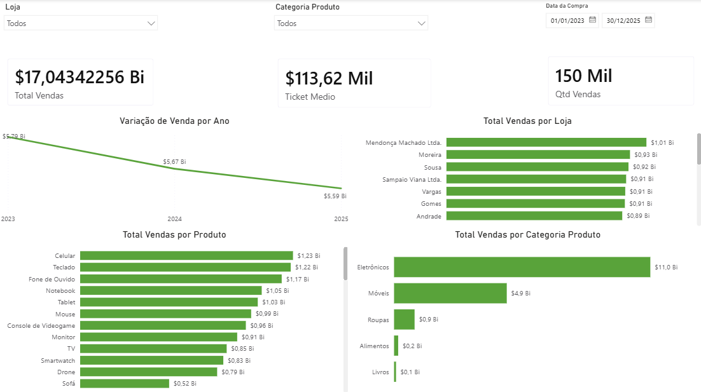

# 📊 Análise de Vendas - Projeto de Data Analytics

Este projeto tem como objetivo analisar a variação das vendas ao longo do tempo e identificar os principais fatores responsáveis por quedas no faturamento, utilizando Python para tratamento de dados e Power BI para visualização.

---
## 📈 Principais Métricas

- 💰 Volume total de vendas: +17B
- 📉 Maior queda mensal: -47%
- 📊 Categorias analisadas: 5
- 📆 Período analisado: 2023 - 2025

---

## 🎯 Problema de Negócio

A empresa apresentou oscilações no volume de vendas ao longo dos períodos analisados.
O objetivo desta análise é responder:

* Quais períodos apresentaram maior queda nas vendas?
* Existe alguma categoria responsável pela redução no faturamento?
* Há padrões sazonais que influenciam o desempenho das vendas?

---

## 🛠️ Tecnologias Utilizadas

* Python (Pandas, NumPy, Matplotlib)
* Jupyter Notebook
* Power BI

---

## 🔄 Pipeline do Projeto

1. Coleta dos dados
2. Tratamento e limpeza com Python
3. Conversão de tipos e padronização de valores
4. Análise exploratória (EDA)
5. Identificação de outliers (método IQR)
6. Criação de métricas e variáveis temporais
7. Exportação dos dados tratados
8. Construção de dashboard interativo no Power BI

---

## 📊 Dashboard

O dashboard foi desenvolvido no Power BI para facilitar a visualização dos principais indicadores e permitir uma análise interativa dos dados.

### 🔎 Principais análises:

* Evolução das vendas ao longo do tempo
* Identificação de períodos com queda acentuada
* Análise de desempenho por categoria de produto
* Ranking de lojas e produtos
* Avaliação de outliers nas vendas

### 📌 Visão Geral




---

## 💡 Principais Insights

- As quedas de vendas concentram-se principalmente nos meses de **janeiro e agosto**, indicando forte influência de sazonalidade
- Não há uma única categoria responsável pela redução do faturamento, sugerindo impacto sistêmico no negócio
- Categorias como **Alimentos e Móveis** apresentaram quedas superiores a **70% em períodos críticos**, evidenciando alta volatilidade
- O comportamento das vendas sugere padrões cíclicos ao longo dos anos, com períodos recorrentes de retração e recuperação

---

## 📁 Estrutura do Projeto

```
📦 analise-vendas-caramelo
├── data/
├── notebooks/
│   └── analise_projeto.ipynb
├── dashboard/
│   └── projeto_caramelo.pbix
├── outputs/
│   └── caramelo_tratado.csv
├── README.md
├── requirements.txt
└── .gitignore
```

---

## ▶️ Como Executar o Projeto

```bash
git clone https://github.com/Giordano0155/analise-vendas-caramelo.git
cd analise-vendas-caramelo
pip install -r requirements.txt
```

---

## 🧠 Diferenciais do Projeto

* Pipeline completo de dados (Python + Power BI)
* Aplicação de análise estatística (detecção de outliers com IQR)
* Foco em análise de negócio e geração de insights
* Identificação de padrões sazonais nas vendas
* Integração entre tratamento de dados e visualização profissional

---

## 📌 Sobre o Projeto

Este projeto foi desenvolvido com foco em simular um cenário real de análise de dados, aplicando técnicas de tratamento, exploração e visualização para apoiar a tomada de decisão.

---
## 👨‍💻 Autor

Desenvolvido por Pablo Giordano.

---
